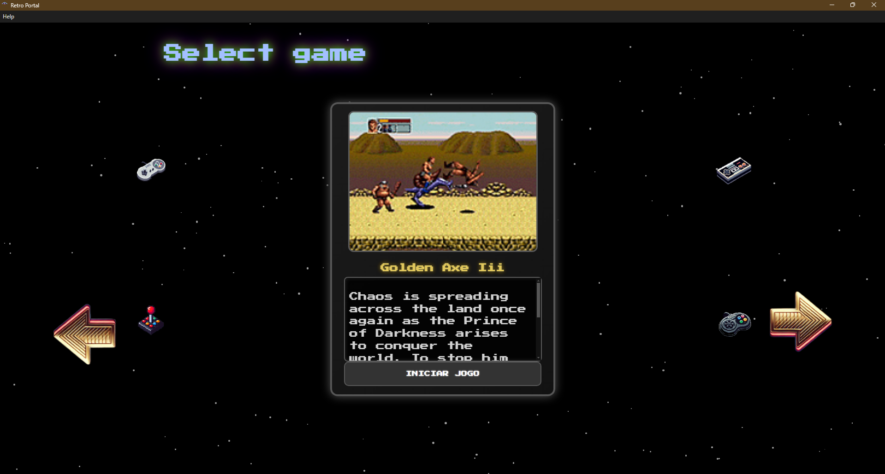

# Retro Portal  

Retro Portal é um aplicativo desktop desenvolvido com **Electron** para facilitar a vida de amantes de jogos retrô. Ele cria uma interface intuitiva e organizada para que você possa visualizar, selecionar e executar suas ROMs diretamente nos respectivos emuladores, tudo em um único lugar!  

Se você já se cansou de abrir exploradores de arquivos para procurar ROMs ou alternar entre diferentes emuladores, o Retro Portal foi feito para você.  

---

## **Funcionalidades**  

- Interface intuitiva para selecionar ROMs, com **imagens** e **descrições** dos jogos.  
- Suporte a **controle (gamepad)**, teclado e mouse.  
- Permite iniciar as ROMs diretamente nos respectivos emuladores.  
- Design focado na simplicidade e praticidade.  

---

## **Limitações Conhecidas**  

- **Informações incompletas de jogos**:  
  O Retro Portal utiliza o serviço [RAWG](https://rawg.io) para obter dados como imagens e descrições dos jogos. Quando você adiciona uma nova rom na pasta "roms" que não tem no meu banco de dados remoto, uma requisição é feita para a RAWG para encontrar informações e popular tanto o banco remoto quanto o seu banco local.

- **Demora no carregamento de dados remotos**:  
  Minha API que gerencia o banco de dados está hospedada no [Render](https://render.com) com o plano free, o que significa que ela entra em modo "sleep" após períodos de inatividade. Por isso, o tempo para carregar informações pode variar caso a API esteja hibernando.  

---

## **Screenshots do Retro Portal**  

1. **Aviso de falta de conteúdo**  
   Quando as pastas `emulators` e `roms` estão vazias ou ausentes, o Retro Portal exibe a seguinte mensagem:  
   _****_  

2. **Menu principal**  
   Interface inicial do Retro Portal:  
   _****_  

3. **Menu de emuladores**  
   Tela para selecionar o emulador desejado:  
   _****_  

4. **Carrossel com informações dos jogos**  
   Lista de ROMs com descrições e imagens (quando disponíveis):  
   _****_

5. **Janela "About"**  
   Uma pequena janela que exibe minhas informações de contato:
   _****_  

---

## **Como Instalar e Configurar o Retro Portal**  

### **Passo 1: Instalar o Retro Portal**  
- Faça o download do instalador a partir do repositório no GitHub (link na seção de releases).  
- Execute o instalador e escolha o diretório onde o Retro Portal será instalado.  

### **Passo 2: Configurar as pastas necessárias**  

1. Acesse o **diretório de instalação** do Retro Portal:  
   _****_  
 
2. Dentro da pasta `resources`, crie as seguintes pastas:  
   - `emulators`  
   - `roms`  
   _****_  

### **Passo 3: Adicionar arquivos às pastas**  

- **Pasta `emulators`**  
  - Insira os executáveis dos emuladores compatíveis (extensão `.exe`).  
  - Atualmente, o Retro Portal suporta os seguintes emuladores:  
    - **Mesen**: NES/Famicom.  
    - **Snes9x**: Super Nintendo/Super Famicom.  
    - **Fusion**: Sega Genesis/Mega Drive.  
  _**()**_  

- **Pasta `roms`**  
  - Insira as ROMs correspondentes aos emuladores que você adicionou na pasta `emulators`.  
  - Certifique-se de que os arquivos sejam compatíveis com os emuladores listados acima.  
  _****_  

---

## **Tecnologias Utilizadas**  

- **Electron**: Para o desenvolvimento do aplicativo desktop.  
- **Node.js**: Para funcionalidades do backend do app.
- **HTML e CSS** puro para a interface visual.  
- **RAWG API**: Para obter informações sobre os jogos.  

---

## **Como Contribuir**  

1. Faça um fork deste repositório.  
2. Crie uma branch para sua feature:  
   ```bash
   git checkout -b minha-feature
3. Commit suas alterações:
    ```bash
    git commit -m "Adicionei uma nova feature"
4. Submeta a branch
    ```bash
    git push origin minha-feature
5. Abra um Pull Request explicando suas alterações

## Agradecimentos

### Muito obrigado por conferir o Retro Portal! Se tiver sugestões, feedback ou se encontrar problemas, abra uma issue ou entre em contato.